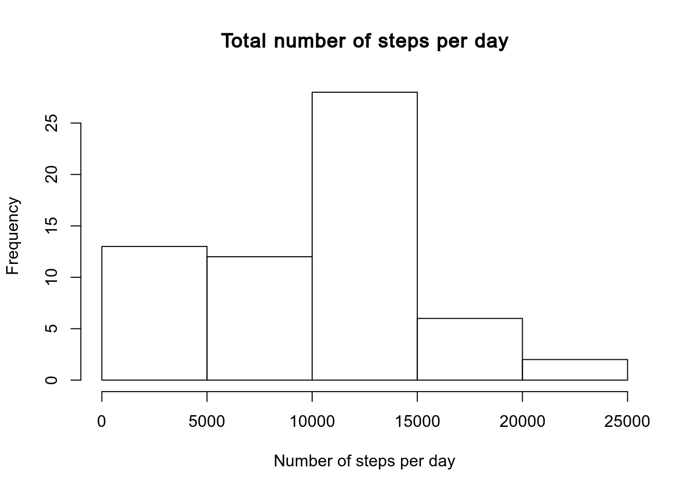

# Purpose

This file was created for the assignement 1 in the Coursera course "Reproducible Research". This file contains all the code and data analysis needed to do the assignement.

# Introduction

It is now possible to collect a large amount of data about personal movement using activity monitoring devices such as a Fitbit, Nike Fuelband, or Jawbone Up. These type of devices are part of the “quantified self” movement – a group of enthusiasts who take measurements about themselves regularly to improve their health, to find patterns in their behavior, or because they are tech geeks. But these data remain under-utilized both because the raw data are hard to obtain and there is a lack of statistical methods and software for processing and interpreting the data.

This assignment makes use of data from a personal activity monitoring device. This device collects data at 5 minute intervals through out the day. The data consists of two months of data from an anonymous individual collected during the months of October and November, 2012 and include the number of steps taken in 5 minute intervals each day.

The data for this assignment can be downloaded from the course web site:

* Dataset: [Activity monitoring data](https://d396qusza40orc.cloudfront.net/repdata%2Fdata%2Factivity.zip)

The variables included in this dataset are:

- **steps** : Number of steps taking in a 5-minute interval (missing values are coded as NA
- **date** : The date on which the measurement was taken in YYYY-MM-DD format
- **interval** : Identifier for the 5-minute interval in which measurement was taken

The dataset is stored in a comma-separated-value (CSV) file and there are a total of 17,568 observations in this dataset.

# Data analysis

## Libraries

Find below the librarires needed for this analysis. Please download and install any package you do not have.


```r
library(data.table)
library(dplyr)
library(ggplot2)
```


## Loading and preprocessing the data

Loading the data and save it into an object called "activity". Please set your working directory where you downloaded the dataset.


```r
activity <- fread("activity.csv")

# First look at the data
str(activity)
```

```
## Classes 'data.table' and 'data.frame':	17568 obs. of  3 variables:
##  $ steps   : int  NA NA NA NA NA NA NA NA NA NA ...
##  $ date    : chr  "2012-10-01" "2012-10-01" "2012-10-01" "2012-10-01" ...
##  $ interval: int  0 5 10 15 20 25 30 35 40 45 ...
##  - attr(*, ".internal.selfref")=<externalptr>
```

```r
head(activity) 
```

```
##    steps       date interval
## 1:    NA 2012-10-01        0
## 2:    NA 2012-10-01        5
## 3:    NA 2012-10-01       10
## 4:    NA 2012-10-01       15
## 5:    NA 2012-10-01       20
## 6:    NA 2012-10-01       25
```

```r
tail(activity)
```

```
##    steps       date interval
## 1:    NA 2012-11-30     2330
## 2:    NA 2012-11-30     2335
## 3:    NA 2012-11-30     2340
## 4:    NA 2012-11-30     2345
## 5:    NA 2012-11-30     2350
## 6:    NA 2012-11-30     2355
```

```r
summary(activity)
```

```
##      steps            date              interval     
##  Min.   :  0.00   Length:17568       Min.   :   0.0  
##  1st Qu.:  0.00   Class :character   1st Qu.: 588.8  
##  Median :  0.00   Mode  :character   Median :1177.5  
##  Mean   : 37.38                      Mean   :1177.5  
##  3rd Qu.: 12.00                      3rd Qu.:1766.2  
##  Max.   :806.00                      Max.   :2355.0  
##  NA's   :2304
```

```r
# There are Na's in the steps column, how many ?
nas <- sum(is.na(activity$steps))

# Converting some class columns
activity$date <- as.Date(activity$date, "%Y-%m-%d") # convert in class Date
activity$steps <- as.numeric(activity$steps) # convert in num
str(activity)
```

```
## Classes 'data.table' and 'data.frame':	17568 obs. of  3 variables:
##  $ steps   : num  NA NA NA NA NA NA NA NA NA NA ...
##  $ date    : Date, format: "2012-10-01" "2012-10-01" ...
##  $ interval: int  0 5 10 15 20 25 30 35 40 45 ...
##  - attr(*, ".internal.selfref")=<externalptr>
```

The dataset is organized in 3 columns: steps, date and interval (Please have a look in the introduction to know their characteristics). The dataset contains 17568 observations and it seems the "steps" column contains a lot of NAs (2304). I converted the classes of the columns "steps" and "date" from "integer" and "character" to "numeric" and "Date" respectively.

## What is mean total number of steps taken per day ?

For this part I will ignore the missing values (NAs) in the dataset.

1. Calculate the total number of steps taken per day


```r
activity_steps <- activity %>%
        group_by(date) %>% # group per date i.e day
        summarize(total = sum(steps, na.rm = T)) # summarise the total
head(activity_steps)
```

```
## # A tibble: 6 x 2
##   date       total
##   <date>     <dbl>
## 1 2012-10-01     0
## 2 2012-10-02   126
## 3 2012-10-03 11352
## 4 2012-10-04 12116
## 5 2012-10-05 13294
## 6 2012-10-06 15420
```

2. Make a histogram of the total number of steps taken each day


```r
hist(activity_steps$total, 
     main = "Total number of steps per day",
     xlab = "Number of steps per day")
```



3. Calculate and report the mean and median of the total number of steps taken per day


```r
mean_steps <- mean(activity_steps$total)
median_steps <- median(activity_steps$total)
```

This first part of the analysis allowed us to calculate the mean and median of the number of the total number of steps taken each day.  
The mean of the total number of steps taken each day is 9354.2295082 and the median is 10395.

## What is the average daily activity pattern ?

1. Make a time-series plot (i.e = type = "l") of the 5-minute interval (x-axis) and the average number of steps taken, averaged across all days (y-axis)


```r
activity_pattern <- activity %>%
        group_by(interval) %>% # group per interval
        summarize(average = mean(steps, na.rm = T)) # summarise the mean
head(activity_pattern)
```

```
## # A tibble: 6 x 2
##   interval average
##      <int>   <dbl>
## 1        0  1.72  
## 2        5  0.340 
## 3       10  0.132 
## 4       15  0.151 
## 5       20  0.0755
## 6       25  2.09
```

```r
ggplot(activity_pattern, aes(x= interval)) +
        geom_line(aes(y=average)) + 
        theme(plot.subtitle = element_text(vjust = 1), 
    plot.caption = element_text(vjust = 1), 
    plot.title = element_text(hjust = 0.5)) +labs(title = "Average number of steps taken by 5 minute intervals accross all days", 
    x = "Interval", y = "Averaged number of steps")
```


2. Which 5-minute interval, on average accross all the days in the dataset, contains the maximum number of steps ?


```r
max_step <- activity_pattern %>%
        filter(average == max(average)) %>%
        select(interval)
```

On avergae the interval where the maximum steps are taken is 835.

## Imputing missing values

1. Calculate and report the total number of missing values in the dataset (i. e the total number of rows with NAs)


```r
nas <- sum(is.na(activity$steps))
```

There are 2304 missing values in the dataset

2. Devise a strategy for filling in all the missing values in the dataset

I choose to replace the missing values by the average steps taken for the 5-minute interval. 


```r
activity %>%
group_by(interval) %>%
        mutate(steps = ifelse(is.na(steps), mean(steps, na.rm = T), steps))
```

```
## # A tibble: 17,568 x 3
## # Groups:   interval [288]
##     steps date       interval
##     <dbl> <date>        <int>
##  1 1.72   2012-10-01        0
##  2 0.340  2012-10-01        5
##  3 0.132  2012-10-01       10
##  4 0.151  2012-10-01       15
##  5 0.0755 2012-10-01       20
##  6 2.09   2012-10-01       25
##  7 0.528  2012-10-01       30
##  8 0.868  2012-10-01       35
##  9 0      2012-10-01       40
## 10 1.47   2012-10-01       45
## # … with 17,558 more rows
```

3. Create a new dataset that is equal to the original dataset but with the missing data filled in


```r
activity_NA <- activity %>%
group_by(interval) %>%
        mutate(steps = ifelse(is.na(steps), mean(steps, na.rm = T), steps))

head(activity_NA)
```

```
## # A tibble: 6 x 3
## # Groups:   interval [6]
##    steps date       interval
##    <dbl> <date>        <int>
## 1 1.72   2012-10-01        0
## 2 0.340  2012-10-01        5
## 3 0.132  2012-10-01       10
## 4 0.151  2012-10-01       15
## 5 0.0755 2012-10-01       20
## 6 2.09   2012-10-01       25
```

```r
summary(activity_NA)
```

```
##      steps             date               interval     
##  Min.   :  0.00   Min.   :2012-10-01   Min.   :   0.0  
##  1st Qu.:  0.00   1st Qu.:2012-10-16   1st Qu.: 588.8  
##  Median :  0.00   Median :2012-10-31   Median :1177.5  
##  Mean   : 37.38   Mean   :2012-10-31   Mean   :1177.5  
##  3rd Qu.: 27.00   3rd Qu.:2012-11-15   3rd Qu.:1766.2  
##  Max.   :806.00   Max.   :2012-11-30   Max.   :2355.0
```

4. Make a histogram of the total number of steps taken each day and Caluclate and report the mean and median total number of steps taken per day. Do these values differ from the estimates from the first part of the assignement? What is the impact of imputing missing data on the estimates of the total daily number of stepa?


```r
activity_steps_NA <- activity_NA %>%
        group_by(date) %>% 
        summarize(total = sum(steps, na.rm = T))
head(activity_steps_NA)
```

```
## # A tibble: 6 x 2
##   date        total
##   <date>      <dbl>
## 1 2012-10-01 10766.
## 2 2012-10-02   126 
## 3 2012-10-03 11352 
## 4 2012-10-04 12116 
## 5 2012-10-05 13294 
## 6 2012-10-06 15420
```

```r
hist(activity_steps_NA$total, 
     main = "Total number of steps per day",
     xlab = "Number of steps per day")
```


```r
mean_steps_NA <- mean(activity_steps_NA$total)
median_steps_NA <- median(activity_steps_NA$total)
```

The mean of the total number of steps taken each day is 10766.1886792 and the median is 10766.1886792. Those values differ from the first calculations. The impact of imputing missing data on the estimates of the daily number of steps make the mean and the median getting close (in this case they are the same). We can see it clearly with both histogram, the one with NAs filled in has its 10000-15000 bin higher (in frequency).

## Are there differences in activity patterns between weekdays and weekends ?

For this part I need to use the filled-in missing values dataset (i.e activity_NA)

1. Create a new factor variable in the dataset with two levels - "weekday" and "weekend" indicating wether a given date is a weekday or a weekend day.


```r
activity_NA_day <- activity_NA %>%
        ungroup %>%
        mutate(Weekday = weekdays(activity_NA$date)) %>%
        mutate(Days = ifelse(Weekday %in% c("Saturday", "Sunday"), "weekend", "weekday"))

head(activity_NA_day)
```

```
## # A tibble: 6 x 5
##    steps date       interval Weekday Days   
##    <dbl> <date>        <int> <chr>   <chr>  
## 1 1.72   2012-10-01        0 Monday  weekday
## 2 0.340  2012-10-01        5 Monday  weekday
## 3 0.132  2012-10-01       10 Monday  weekday
## 4 0.151  2012-10-01       15 Monday  weekday
## 5 0.0755 2012-10-01       20 Monday  weekday
## 6 2.09   2012-10-01       25 Monday  weekday
```

```r
str(activity_NA_day)
```

```
## Classes 'tbl_df', 'tbl' and 'data.frame':	17568 obs. of  5 variables:
##  $ steps   : num  1.717 0.3396 0.1321 0.1509 0.0755 ...
##  $ date    : Date, format: "2012-10-01" "2012-10-01" ...
##  $ interval: int  0 5 10 15 20 25 30 35 40 45 ...
##  $ Weekday : chr  "Monday" "Monday" "Monday" "Monday" ...
##  $ Days    : chr  "weekday" "weekday" "weekday" "weekday" ...
```

```r
activity_NA_day$Days <- as.factor(activity_NA_day$Days)
str(activity_NA_day)
```

```
## Classes 'tbl_df', 'tbl' and 'data.frame':	17568 obs. of  5 variables:
##  $ steps   : num  1.717 0.3396 0.1321 0.1509 0.0755 ...
##  $ date    : Date, format: "2012-10-01" "2012-10-01" ...
##  $ interval: int  0 5 10 15 20 25 30 35 40 45 ...
##  $ Weekday : chr  "Monday" "Monday" "Monday" "Monday" ...
##  $ Days    : Factor w/ 2 levels "weekday","weekend": 1 1 1 1 1 1 1 1 1 1 ...
```

2. Make a panel plot containing a time series plot (i.e type = "l") of the 5 minute interval (x-axis) and the average number of steps taken, averaged accross all weekday days or weekend days (y-axis)


```r
# First I need to do a little bit of manipulation on the dataset

activity_NA_day_pattern <- activity_NA_day %>%
        group_by(Days, interval) %>% 
        summarize(average = mean(steps, na.rm = T)) 
head(activity_NA_day_pattern)
```

```
## # A tibble: 6 x 3
## # Groups:   Days [1]
##   Days    interval average
##   <fct>      <int>   <dbl>
## 1 weekday        0  2.25  
## 2 weekday        5  0.445 
## 3 weekday       10  0.173 
## 4 weekday       15  0.198 
## 5 weekday       20  0.0990
## 6 weekday       25  1.59
```

```r
# Plot

ggplot(activity_NA_day_pattern, aes(x= interval)) +
        geom_line(aes(y=average)) + 
        facet_grid(Days~.) +
        theme(plot.subtitle = element_text(vjust = 1), 
    plot.caption = element_text(vjust = 1), 
    plot.title = element_text(hjust = 0.5, size = 11, face = 'bold')) +labs(title = "Average number of steps taken by 5 minute intervals accross weekday or weekend days", 
    x = "Interval", y = "Averaged number of steps")
```


With this histogram we can see that during the weekend the average number of steps is lower than during the weekday days. However the maximum of steps seems to be around the same 5 minute interval. 
